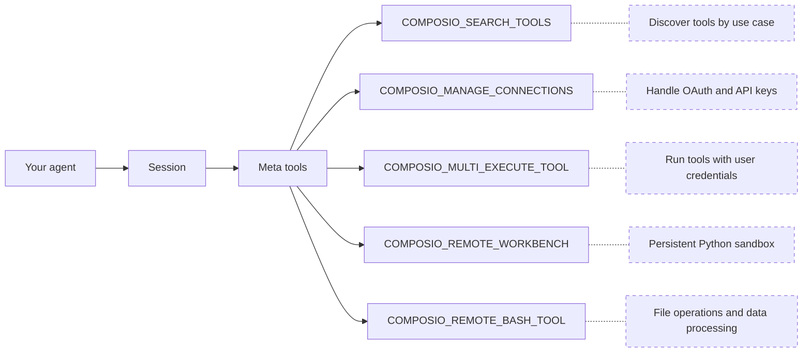
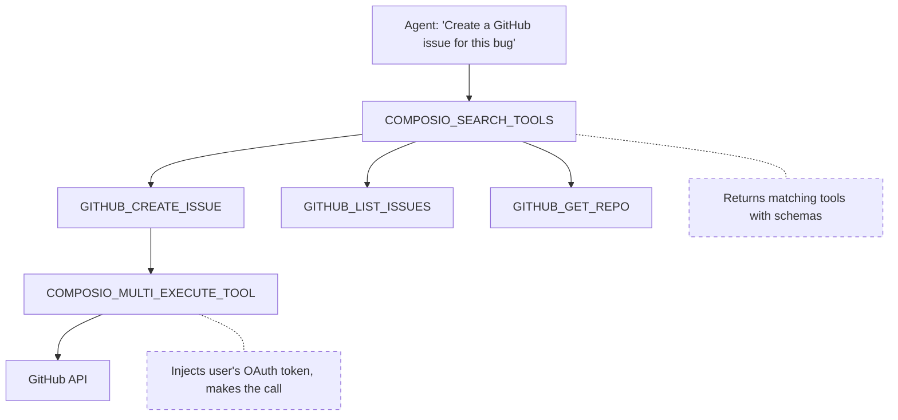

Composio connects AI agents to external services like GitHub, Gmail, and Slack. Your agent gets a small set of meta tools that can discover, authenticate, and execute tools across hundreds of apps at runtime.

This page covers sessions, the meta tool pattern, authentication, and how tools execute. For setup, see the [quickstart](/docs/quickstart). For detailed concepts, see [Users & Sessions](/docs/users-and-sessions) and [Tools and toolkits](/docs/tools-and-toolkits).

## Sessions

When your app calls `composio.create()`, it creates a session scoped to a user.

```python
composio = Composio()
session = composio.create(user_id="user_123")

# Get tools formatted for your provider
tools = session.tools()

# Or get the MCP endpoint for MCP-compatible frameworks
mcp_url = session.mcp.url
mcp_headers = session.mcp.headers
```

A session ties together:

- **A user**: whose credentials and connections to use
- **Available toolkits**: all by default, or a specific set you configure
- **Auth configuration**: which authentication method and connected accounts to use

Sessions are immutable. Their configuration is fixed at creation. If the context changes (different toolkits, different connected account), create a new session. You don't need to cache or manage session IDs.

<Card icon={<BookOpen />} title="Users & Sessions" href="/docs/users-and-sessions" description="How users and sessions scope tools and connections" />

## Meta tools

Rather than loading hundreds of tool definitions into your agent's context, a session provides 5 meta tools:



| Meta tool | What it does |
|-----------|-------------|
| `COMPOSIO_SEARCH_TOOLS` | Finds relevant tools by use case, returns input schemas, connection status, execution plan, and related tools |
| `COMPOSIO_MANAGE_CONNECTIONS` | Generates Connect Links for OAuth and API key authentication |
| `COMPOSIO_MULTI_EXECUTE_TOOL` | Executes up to 20 tools in parallel with the user's credentials |
| `COMPOSIO_REMOTE_WORKBENCH` | Runs Python code in a [persistent sandbox](/docs/workbench) |
| `COMPOSIO_REMOTE_BASH_TOOL` | Runs bash commands in the same sandbox for file operations and data processing |

Meta tool calls within a session share context through a `session_id`. The agent can search for a tool in one call and execute it in the next without losing state. Tools can also store information (IDs, relationships) in memory for subsequent calls.

### How they work together

The meta tools are how the agent reaches the actual toolkit tools:



`COMPOSIO_SEARCH_TOOLS` discovers the right toolkit tools for the task. `COMPOSIO_MULTI_EXECUTE_TOOL` runs them against the external API with the user's credentials. If the user isn't authenticated yet, `COMPOSIO_MANAGE_CONNECTIONS` handles that in between.

For large responses or bulk operations (labeling hundreds of emails, processing CSVs), the agent uses `COMPOSIO_REMOTE_WORKBENCH` to run Python with helper functions like `invoke_llm` and `run_composio_tool`.

<Card icon={<BookOpen />} title="Tools and toolkits" href="/docs/tools-and-toolkits" description="Meta tools, context management, and execution" />

## Tool discovery

When the agent calls `COMPOSIO_SEARCH_TOOLS`, Composio runs a Vector + BM25 hybrid search across all available toolkits to find the right tools for a given use-case query. The search returns matching tool schemas, connection statuses, and related tools in a single call.

Composio also surfaces **learned plans** from past executions. These are step-by-step workflows that have worked before for similar tasks, guiding the LLM to better perform an operation without starting from scratch.

## Authentication

When a tool requires authentication and the user hasn't connected yet, the agent uses `COMPOSIO_MANAGE_CONNECTIONS` to generate a **Connect Link**, a hosted page where the user authorizes access.

In a conversation, this looks like:

> **You:** Create a GitHub issue for the login bug
>
> **Agent:** You'll need to connect your GitHub account. Please authorize here: \<Connect Link\>
>
> **You:** Done
>
> **Agent:** Created issue #42 on your-org/your-repo.

Composio manages the OAuth flow end to end: redirects, authorization codes, token exchange, and automatic token refresh before expiration. Credentials are encrypted and scoped to user IDs.

Connections persist across sessions. A user who connects GitHub once can use it in every future session without re-authenticating. Users can also connect multiple accounts for the same service (work and personal Gmail, for example).

For apps that manage auth outside of chat, like during onboarding or on a settings page, use `session.authorize()` to generate Connect Links programmatically and wait for the user to complete the flow.

<Cards>
  <Card icon={<Key />} title="Authentication" href="/docs/authentication" description="Connect Links, OAuth, API keys, and custom auth configs" />
  <Card icon={<BookOpen />} title="Manual authentication" href="/docs/authenticating-users/manually-authenticating" description="Authenticate users outside of chat with session.authorize()" />
</Cards>

## Tool execution

When the agent calls `COMPOSIO_MULTI_EXECUTE_TOOL`, Composio resolves the session to look up the user and their connections, validates the input against the tool's schema, injects the user's OAuth token or API key, calls the external API, and returns a structured result.

Your agent doesn't touch API credentials or handle token refresh. Composio resolves credentials from the session and connected account, makes the authenticated call, and returns the result.

## Remote workbench

Large responses from `COMPOSIO_MULTI_EXECUTE_TOOL` are automatically synced to a secure remote workbench. Instead of stuffing thousands of lines into the context window, the agent can work with the data inside the workbench:

- **Reading** files and tool responses
- **Searching** across large outputs
- **Writing and executing** Python code to transform, filter, or aggregate data
- **Calling Composio tools** via the `run_composio_tool` helper for bulk orchestration

This keeps the agent's context window lean while still letting it handle operations like labeling hundreds of emails, processing CSV exports, or summarizing long API responses.

<Card icon={<BookOpen />} title="Workbench" href="/docs/workbench" description="Persistent Python sandbox for large-context operations" />

## Direct tool execution

If you know exactly which tools you need, you can skip the meta tool pattern and execute tools directly:

```python
composio = Composio()

tools = composio.tools.get(
    user_id="user_123",
    toolkits=["github"]
)

result = composio.tools.execute(
    "GITHUB_STAR_REPOSITORY",
    user_id="user_123",
    arguments={"owner": "composiohq", "repo": "composio"}
)
```

This is useful for deterministic workflows where the agent doesn't need to discover tools at runtime.

<Card icon={<BookOpen />} title="Direct tool execution" href="/docs/tools-direct/executing-tools" description="Fetch, authenticate, and execute tools without meta tools" />
