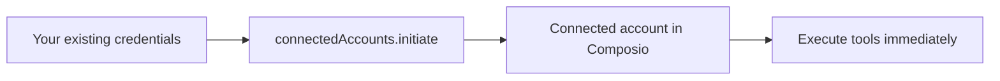

If your users have already authenticated with a service and you have their credentials (API keys, bearer tokens, etc.), you can pass those directly into Composio. No re-authentication required.

This is useful when:
- Your app already stores API keys or tokens for users
- You're adopting Composio and want to onboard existing users without disrupting them
- Another platform already holds credentials for your users' accounts

## How it works

Instead of asking users to authenticate again, you pass their existing credentials to `connectedAccounts.initiate()` using the `AuthScheme` helpers. Composio creates a connected account directly from those credentials.



## Prerequisites

1. **An auth config** for the toolkit you're importing into
2. **The existing credentials** for each user (API keys, bearer tokens, username/password, etc.)
3. **A user ID** for each user, any string that uniquely identifies them in your system

<Callout type="warn">
Importing existing OAuth tokens (access tokens, refresh tokens) is **not currently supported**. For OAuth-based services (Google, GitHub, Slack, etc.), users must authenticate through the standard [OAuth flow](/docs/tools-direct/authenticating-tools). This page covers importing non-OAuth credentials like API keys, bearer tokens, and basic auth.
</Callout>

## API keys

For services that use API key authentication (e.g., SendGrid, Tavily, PostHog):

<Tabs groupId="language" items={['Python', 'TypeScript']} persist>
<Tab value="Python">
```python
from composio import Composio
from composio.types import auth_scheme

composio = Composio(api_key="your-api-key")

connection = composio.connected_accounts.initiate(
    user_id="user_123",
    auth_config_id="ac_your_auth_config",
    config=auth_scheme.api_key({
        "api_key": "sg-existing-sendgrid-key",
    }),
)

# API key connections are immediately active
print(f"Connected: {connection.id}")
```
</Tab>
<Tab value="TypeScript">
```typescript
import { Composio, AuthScheme } from '@composio/core';

const composio = new Composio({ apiKey: 'your-api-key' });

const connection = await composio.connectedAccounts.initiate(
  'user_123',
  'ac_your_auth_config',
  {
    config: AuthScheme.APIKey({
      api_key: 'sg-existing-sendgrid-key',
    }),
  }
);

// API key connections are immediately active
console.log('Connected:', connection.id);
```
</Tab>
</Tabs>

## Bearer tokens

<Tabs groupId="language" items={['Python', 'TypeScript']} persist>
<Tab value="Python">
```python
from composio import Composio
from composio.types import auth_scheme

composio = Composio(api_key="your-api-key")

connection = composio.connected_accounts.initiate(
    user_id="user_123",
    auth_config_id="ac_your_auth_config",
    config=auth_scheme.bearer_token({
        "token": "existing-bearer-token",
    }),
)

# Bearer token connections are immediately active
print(f"Connected: {connection.id}")
```
</Tab>
<Tab value="TypeScript">
```typescript
import { Composio, AuthScheme } from '@composio/core';

const composio = new Composio({ apiKey: 'your-api-key' });

const connection = await composio.connectedAccounts.initiate(
  'user_123',
  'ac_your_auth_config',
  {
    config: AuthScheme.BearerToken({
      token: 'existing-bearer-token',
    }),
  }
);

// Bearer token connections are immediately active
console.log('Connected:', connection.id);
```
</Tab>
</Tabs>

## Basic auth

<Tabs groupId="language" items={['Python', 'TypeScript']} persist>
<Tab value="Python">
```python
from composio import Composio
from composio.types import auth_scheme

composio = Composio(api_key="your-api-key")

connection = composio.connected_accounts.initiate(
    user_id="user_123",
    auth_config_id="ac_your_auth_config",
    config=auth_scheme.basic({
        "username": "user@example.com",
        "password": "existing-password",
    }),
)

# Basic auth connections are immediately active
print(f"Connected: {connection.id}")
```
</Tab>
<Tab value="TypeScript">
```typescript
import { Composio, AuthScheme } from '@composio/core';

const composio = new Composio({ apiKey: 'your-api-key' });

const connection = await composio.connectedAccounts.initiate(
  'user_123',
  'ac_your_auth_config',
  {
    config: AuthScheme.Basic({
      username: 'user@example.com',
      password: 'existing-password',
    }),
  }
);

// Basic auth connections are immediately active
console.log('Connected:', connection.id);
```
</Tab>
</Tabs>

## What to read next

<Cards>
  <Card icon={<Key />} title="Custom auth configs" href="/docs/using-custom-auth-configuration" description="Set up auth configs with your own OAuth credentials" />
  <Card icon={<Database />} title="Connected accounts" href="/docs/auth-configuration/connected-accounts" description="Manage connected accounts after importing" />
  <Card icon={<Palette />} title="White-labeling" href="/docs/white-labeling-authentication" description="Use your own branding on OAuth consent screens" />
</Cards>
