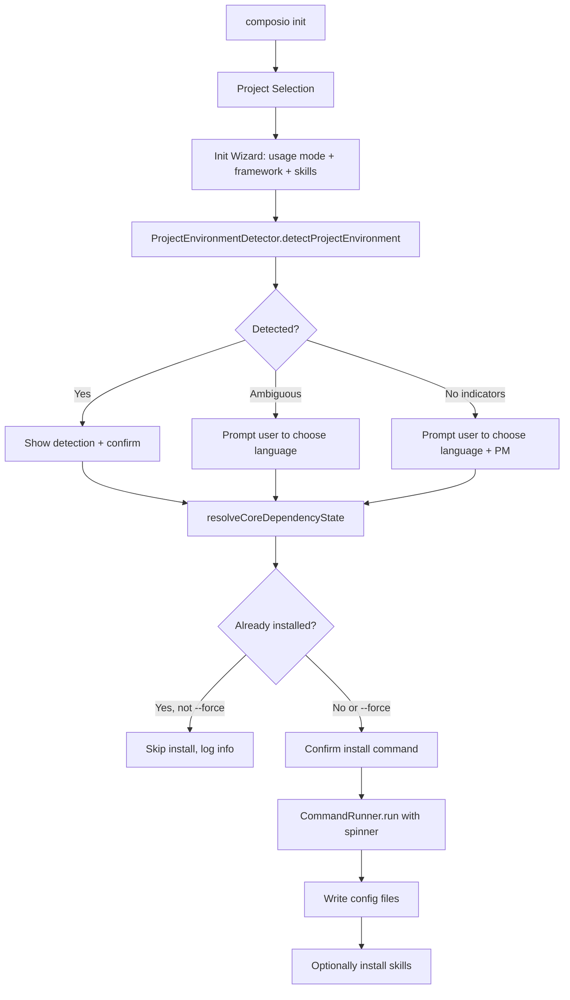

# feat: Add project environment detection and dependency installation to `composio init`

## Overview

Enhance `composio init` to automatically detect the project environment (TypeScript/Python, package manager, monorepo vs single-package) and install Composio's SDK dependencies using the correct package manager command. This replaces the existing `EnvLangDetector` + `JsPackageManagerDetector` services with a unified `ProjectEnvironmentDetector` service that produces richer detection results, and adds a `CommandRunner` service for running install commands in tests.

## Problem Statement / Motivation

Currently, `composio init` writes config files but does **not**:
- Detect what kind of project the user is working in
- Install Composio SDK packages (`@composio/core` for TS, `composio` for Python)
- Install framework-specific provider packages (`@composio/mastra`, `@composio/openai`, etc.)

Users must manually figure out which packages to install and run the correct package manager command. This is error-prone, especially in monorepos where the package manager may differ from what the user expects.

The `composio2` branch already has working implementations of `ProjectEnvironmentDetector`, `CommandRunner`, `core-dependency.ts`, and an `install.cmd.ts` with tests. This plan imports and adapts those implementations into the current `feat/cli-login-2.0` branch.

## Proposed Solution

### Architecture



### Key Components

1. **`ProjectEnvironmentDetector`** (new service) — replaces `EnvLangDetector` + `JsPackageManagerDetector` with a single service that:
   - Walks up the directory tree looking for project indicators
   - Produces a `ProjectEnvironment` discriminated union (`js` | `python`)
   - Includes `language`, `packageManager`, `rootDir`, and `evidence[]`
   - Handles ambiguity (both JS and Python indicators) with a tagged error
   - Supports Deno (`deno.json`, `deno.lock`) as a JS package manager

2. **`CommandRunner`** (new service) — thin wrapper around `@effect/platform` `Command.exitCode` for testability. In production, it runs the actual command; in tests, it returns a configurable exit code.

3. **`core-dependency.ts`** (new effect) — maps a `ProjectEnvironment` to a `CoreDependencyPlan` containing the install command string, dependency name, and package manager. Also detects if the dependency is already installed.

4. **Updated `init.cmd.ts`** — integrates detection + installation into the wizard flow after project selection.

## Technical Approach

### Phase 1: New Services and Effects

#### 1.1 Add `ProjectEnvironmentDetector` service

**File:** `ts/packages/cli/src/services/project-environment-detector.ts`

Import from: `/Users/jkomyno/work/composio/composio2/ts/packages/cli/src/services/project-environment-detector.ts`

The reference implementation is 587 lines and provides:

```typescript
export type ProjectEnvironment =
  | { kind: 'js'; language: JsLanguage; packageManager: JsPackageManager; rootDir: string; evidence: string[] }
  | { kind: 'python'; language: 'python'; packageManager: PythonPackageManager; rootDir: string; evidence: string[] };

export type JsLanguage = 'typescript' | 'javascript';
export type JsPackageManager = 'pnpm' | 'bun' | 'yarn' | 'npm' | 'deno';
export type PythonPackageManager = 'uv' | 'pip';
```

Key detection strategies:
- **Strong JS indicators:** `package.json`, `tsconfig.json`, `pnpm-workspace.yaml`, lock files — each gets a high score
- **Strong Python indicators:** `pyproject.toml`, `setup.py`, `requirements.txt`, `uv.lock`, `poetry.lock`
- **Weak indicators:** file extension counts (`.ts`, `.py`), subdirectory scans
- **Package manager from `package.json`:** reads `packageManager` field (e.g., `"pnpm@9.0.0"`)
- **Python package manager:** checks for `uv.lock` or `[tool.uv]` in `pyproject.toml`
- **Ancestor walking:** walks up from CWD to filesystem root, checking each directory

**Ambiguity handling:** If both JS and Python strong indicators exist at CWD depth 0, fails with `ProjectEnvironmentDetectorError`. At deeper levels, skips and continues searching.

**Service pattern:** Uses `Effect.Service` class with `effect:` body and `dependencies: [BunFileSystem.layer]`.

#### 1.2 Add `CommandRunner` service

**File:** `ts/packages/cli/src/services/command-runner.ts`

Import from: `/Users/jkomyno/work/composio/composio2/ts/packages/cli/src/services/command-runner.ts`

```typescript
import { Command } from '@effect/platform';
import { Effect } from 'effect';

export class CommandRunner extends Effect.Service<CommandRunner>()('services/CommandRunner', {
  sync: () => ({
    run: (command: Command.Command) => Command.exitCode(command),
  }),
  dependencies: [],
}) {}
```

This is intentionally thin — the real value is in testability. In tests, we provide `Layer.succeed(CommandRunner, new CommandRunner({ run: () => Effect.succeed(ExitCode(0)) }))`.

#### 1.3 Add `core-dependency.ts` effect

**File:** `ts/packages/cli/src/effects/core-dependency.ts`

Import from: `/Users/jkomyno/work/composio/composio2/ts/packages/cli/src/effects/core-dependency.ts`

Key exports:
- `CoreDependencyPlan` — discriminated union with `installCommand`, `dependency`, `packageManager`, `rootDir`
- `detectCoreDependencyPlan(cwd)` — maps `ProjectEnvironment` → `CoreDependencyPlan`
- `detectCoreDependencyVersion(plan)` — checks if `@composio/core` or `composio` is already installed
- `resolveCoreDependencyState(cwd)` — combines plan + version check
- `getJsInstallCommand(pm, dependency)` — maps package manager to install command
- `getPythonInstallCommand(pm, dependency)` — same for Python

Install command mapping:

| PM | Command |
|---|---|
| pnpm | `pnpm add @composio/core` |
| bun | `bun add @composio/core` |
| yarn | `yarn add @composio/core` |
| npm | `npm install -S @composio/core` |
| deno | `deno add npm:@composio/core` |
| uv | `uv pip install composio` |
| pip | `pip install composio` |

### Phase 2: Update `composio init` Command

#### 2.1 Add new CLI flags

```typescript
const dryRunOpt = Options.boolean('dry-run').pipe(
  Options.withDefault(false),
  Options.withDescription('Print install command without executing it')
);

const forceOpt = Options.boolean('force').pipe(
  Options.withDefault(false),
  Options.withDescription('Reinstall even if dependency appears installed')
);

const yesOpt = Options.boolean('yes').pipe(
  Options.withAlias('y'),
  Options.withDefault(false),
  Options.withDescription('Skip confirmation prompts')
);
```

#### 2.2 Extend `InitConfigBuilder` and `InitConfig`

Add new builder steps and fields:

```typescript
interface InitConfig {
  readonly usageMode: UsageMode;
  readonly framework: NativeFramework | undefined;
  readonly installSkills: boolean;
  readonly detectedEnv: ProjectEnvironment;       // NEW
  readonly installPlan: CoreDependencyPlan;        // NEW
}
```

Add `withDetectedEnv` and `withInstallPlan` methods to `InitConfigBuilder`, and update the `build()` type constraint.

#### 2.3 Updated wizard flow

After the existing wizard steps (usage mode → framework → skills), add:

```typescript
// Step 4: Detect project environment
const envDetector = yield* ProjectEnvironmentDetector;
const detectedEnv = yield* envDetector
  .detectProjectEnvironment(proc.cwd)
  .pipe(
    Effect.catchTag('services/ProjectEnvironmentDetectorError', e =>
      Effect.gen(function* () {
        yield* ui.log.warn(e.message);
        // Fallback: ask user to choose
        const lang = yield* ui.select('What language is your project?', [
          { value: 'typescript', label: 'TypeScript' },
          { value: 'python', label: 'Python' },
        ]);
        // ... prompt for package manager too
      })
    )
  );

yield* ui.log.step(`Detected: ${detectedEnv.language} (${detectedEnv.packageManager})`);

// Step 5: Check if already installed + determine install plan
const { plan, installedVersion } = yield* resolveCoreDependencyState(proc.cwd);

if (installedVersion && !forceOpt) {
  yield* ui.log.info(`Found ${plan.dependency}: ${installedVersion.version}`);
  yield* ui.log.success('Dependency already installed.');
} else {
  // Step 6: Confirm and install
  if (dryRunOpt) {
    yield* ui.note(plan.installCommand, 'Install Command');
  } else {
    const shouldInstall = yesOpt || (yield* ui.confirm(`Run: ${plan.installCommand}?`));
    if (shouldInstall) {
      yield* ui.withSpinner(`Installing ${plan.dependency}...`, installEffect, {
        successMessage: `Installed ${plan.dependency}`,
      });
    }
  }
}
```

#### 2.4 Framework provider installation

When a framework is selected (not "skip"), also install the provider package:

```typescript
const frameworkPackage = getFrameworkPackage(config.framework, detectedEnv);
// e.g., '@composio/mastra' for TS, 'composio[mastra]' for Python
```

| Framework | TS Package | Python Package |
|---|---|---|
| ai-sdk | `@composio/vercel` | `composio[vercel]` |
| mastra | `@composio/mastra` | `composio[mastra]` |
| openai-agents | `@composio/openai` | `composio[openai]` |
| claude-agent-sdk | `@composio/anthropic` | `composio[anthropic]` |

### Phase 3: Wire Services in Layer Composition

#### 3.1 Update `bin.ts`

Add to the layer composition:

```typescript
import { ProjectEnvironmentDetector } from 'src/services/project-environment-detector';
import { CommandRunner } from 'src/services/command-runner';

const layers = Layer.mergeAll(
  // ... existing layers ...
  ProjectEnvironmentDetector.Default,  // NEW
  CommandRunner.Default,               // NEW
);
```

#### 3.2 Deprecate `EnvLangDetector` and `JsPackageManagerDetector`

The new `ProjectEnvironmentDetector` subsumes both. However, `EnvLangDetector` is still used by `generate.cmd.ts`. Options:

- **Option A (recommended):** Keep both old services for now, use `ProjectEnvironmentDetector` only in `init.cmd.ts`. Migrate `generate.cmd.ts` in a follow-up PR.
- **Option B:** Replace both immediately and update `generate.cmd.ts` to use the new service.

Go with **Option A** to keep this PR focused.

### Phase 4: Testing (TDD)

#### 4.1 Unit tests for `ProjectEnvironmentDetector`

**File:** `ts/packages/cli/test/src/services/project-environment-detector.test.ts`

Uses `tempy.temporaryDirectory()` to create isolated temp dirs with specific file layouts. Tests use `BunFileSystem.layer` (real filesystem).

```
describe('ProjectEnvironmentDetector', () => {
  describe('detectProjectEnvironment', () => {
    // TypeScript detection
    it('[Given] package.json + tsconfig.json [Then] detects typescript + npm')
    it('[Given] pnpm-lock.yaml + package.json with packageManager:pnpm@ [Then] detects typescript + pnpm')
    it('[Given] bun.lockb [Then] detects javascript + bun')
    it('[Given] deno.json [Then] detects typescript + deno')
    it('[Given] package.json with typescript dep [Then] detects typescript')

    // Python detection
    it('[Given] pyproject.toml with [tool.uv] [Then] detects python + uv')
    it('[Given] requirements.txt only [Then] detects python + pip')
    it('[Given] uv.lock [Then] detects python + uv')
    it('[Given] setup.py only [Then] detects python + pip')

    // Ambiguity
    it('[Given] both package.json + pyproject.toml at CWD [Then] fails with ambiguity error')
    it('[Given] both indicators but only at parent level [Then] skips and continues')

    // Ancestor walking
    it('[Given] indicators at parent directory [Then] detects from parent')
    it('[Given] no indicators anywhere [Then] fails with no-detection error')

    // File extension fallback
    it('[Given] only .ts files, no config files [Then] detects typescript via weak signals')
    it('[Given] only .py files, no config files [Then] detects python via weak signals')

    // Edge cases
    it('[Given] empty directory [Then] fails with no-detection error')
    it('[Given] monorepo root with pnpm-workspace.yaml [Then] detects pnpm')
  })

  describe('detectJsPackageManager', () => {
    it('[Given] packageManager field in package.json [Then] uses that')
    it('[Given] lock file present [Then] detects from lock file')
    it('[Given] no lock file, no packageManager field [Then] defaults to npm')
  })

  describe('detectPythonPackageManager', () => {
    it('[Given] uv.lock present [Then] detects uv')
    it('[Given] [tool.uv] in pyproject.toml [Then] detects uv')
    it('[Given] no uv indicators [Then] defaults to pip')
  })
})
```

#### 4.2 Unit tests for `core-dependency.ts`

**File:** `ts/packages/cli/test/src/effects/core-dependency.test.ts`

```
describe('core-dependency', () => {
  describe('getJsInstallCommand', () => {
    it('[Given] pnpm [Then] returns "pnpm add <dep>"')
    it('[Given] npm [Then] returns "npm install -S <dep>"')
    it('[Given] yarn [Then] returns "yarn add <dep>"')
    it('[Given] bun [Then] returns "bun add <dep>"')
    it('[Given] deno [Then] returns "deno add npm:<dep>"')
  })

  describe('getPythonInstallCommand', () => {
    it('[Given] uv [Then] returns "uv pip install <dep>"')
    it('[Given] pip [Then] returns "pip install <dep>"')
  })

  describe('detectCoreDependencyPlan', () => {
    it('[Given] TS project [Then] plans @composio/core install')
    it('[Given] Python project [Then] plans composio install')
  })

  describe('detectCoreDependencyVersion', () => {
    it('[Given] @composio/core in node_modules [Then] returns version')
    it('[Given] @composio/core in pnpm virtual store [Then] returns version')
    it('[Given] not installed [Then] returns null')
  })
})
```

#### 4.3 Command tests for `composio init`

**File:** `ts/packages/cli/test/src/commands/init.cmd.test.ts`

Uses `TestLive` with fixtures and mocked services.

```
describe('CLI: composio init', () => {
  // Agent-native path (--org-id + --project-id)
  describe('[Given] --org-id + --project-id flags', () => {
    layer(TestLive({ fixture: 'typescript-project' }))(it => {
      it.scoped('[Then] detects TS project and shows install plan', () => ...)
    })

    layer(TestLive({ fixture: 'python-project' }))(it => {
      it.scoped('[Then] detects Python project and shows install plan', () => ...)
    })
  })

  // Dry-run mode
  describe('[Given] --dry-run flag', () => {
    layer(TestLive({ fixture: 'typescript-project' }))(it => {
      it.scoped('[Then] prints install command without executing', () => ...)
    })
  })

  // Already installed
  describe('[Given] @composio/core already in node_modules', () => {
    layer(TestLive({ fixture: 'typescript-project-with-composio-core' }))(it => {
      it.scoped('[Then] skips install', () => ...)
    })
  })

  // --force reinstall
  describe('[Given] --force flag with dependency installed', () => {
    layer(TestLive({ fixture: 'typescript-project-with-composio-core', commandRunner: successRunner }))(it => {
      it.scoped('[Then] reinstalls', () => ...)
    })
  })

  // Install failure
  describe('[Given] install command fails', () => {
    layer(TestLive({ fixture: 'typescript-project', commandRunner: failRunner }))(it => {
      it.scoped('[Then] shows error message', () => ...)
    })
  })
})
```

#### 4.4 New test fixtures needed

```
test/__fixtures__/
  typescript-project/                    # EXISTING: package.json + tsconfig.json
  python-project/                        # EXISTING: requirements.txt + setup.py
  typescript-project-with-composio-core/ # EXISTING
  python-project-with-composio-core/     # EXISTING
  typescript-pnpm-monorepo/              # NEW: pnpm-workspace.yaml + package.json with packageManager:pnpm@
  typescript-bun-project/                # NEW: bun.lockb + package.json
  python-uv-project/                     # NEW: pyproject.toml with [tool.uv] + uv.lock
  ambiguous-project/                     # NEW: package.json + pyproject.toml (for error case)
```

#### 4.5 Test layer updates

Update `TestLive` interface to accept optional overrides:

```typescript
interface TestLiveInput {
  // ... existing fields ...
  commandRunner?: CommandRunner;    // NEW: mock for CommandRunner
  terminalUI?: TerminalUI;         // NEW: override TerminalUI for custom prompt behavior
}
```

Add `ProjectEnvironmentDetector.Default` and `CommandRunner.Default` (or mock) to the test layer composition.

### Phase 5: E2E Tests

#### 5.1 `composio init` deterministic E2E test

**Directory:** `ts/e2e-tests/cli/init/`

**Constraint:** E2E tests run inside Docker containers. The init command requires API access for project listing, which makes it hard to test end-to-end without mocking.

**Deterministic test strategy:** Use `--org-id` + `--project-id` flags to bypass API calls. Pre-create a fixture project directory inside the Docker container.

```typescript
// ts/e2e-tests/cli/init/e2e.test.ts
e2e(import.meta.url, {
  versions: { cli: ['current'] },
  defineTests: ({ runCmd }) => {
    describe('composio init --dry-run', () => {
      it('detects TypeScript project', async () => {
        // Create a minimal TS project in the container
        await runCmd('mkdir -p /tmp/test-ts && echo \'{"name":"test"}\' > /tmp/test-ts/package.json');
        await runCmd('echo \'{}\' > /tmp/test-ts/tsconfig.json');

        const result = await runCmd(
          'cd /tmp/test-ts && composio init --org-id test-org --project-id test-proj --dry-run'
        );

        expect(result.exitCode).toBe(0);
        // In non-interactive (piped) mode, output() writes JSON to stdout
        expect(result.stdout).toContain('typescript');
      });
    });

    describe('composio init on Python project', () => {
      it('detects Python project', async () => {
        await runCmd('mkdir -p /tmp/test-py && echo "composio" > /tmp/test-py/requirements.txt');

        const result = await runCmd(
          'cd /tmp/test-py && composio init --org-id test-org --project-id test-proj --dry-run'
        );

        expect(result.exitCode).toBe(0);
        expect(result.stdout).toContain('python');
      });
    });
  },
});
```

**Note:** The init command's interactive prompts are automatically skipped in piped mode (TerminalUI returns defaults). The `--dry-run` flag prevents actual package installation.

## Alternative Approaches Considered

### A. Extend existing `EnvLangDetector` + `JsPackageManagerDetector`

**Rejected because:** The existing services have separate interfaces that would need to be called independently and manually composed. The `ProjectEnvironmentDetector` provides a single, unified detection result with richer evidence tracking and proper ambiguity handling.

### B. Separate `composio install` command

**Reference:** The `composio2` branch already has a standalone `install.cmd.ts`.

**Decision:** Both approaches have merit. The `composio init` command should include dependency installation as part of the initialization flow. A separate `composio install` command could be added later for re-installation or CI use. This plan focuses on integrating detection + installation into `init`.

### C. Use `Effect.Service` class vs `Context.Tag` for new services

**Decision:** Use `Effect.Service` class pattern (newer pattern) for consistency with `EnvLangDetector`, `JsPackageManagerDetector`, `NodeOs`, `NodeProcess`.

## Acceptance Criteria

### Functional Requirements

- [ ] `composio init` detects TypeScript projects (from `tsconfig.json`, `package.json`, lock files)
- [ ] `composio init` detects Python projects (from `pyproject.toml`, `setup.py`, `requirements.txt`)
- [ ] `composio init` detects the correct package manager (pnpm, npm, yarn, bun, deno, uv, pip)
- [ ] `composio init` walks up the directory tree to find project root (monorepo support)
- [ ] `composio init` shows the detected environment and asks for confirmation before installing
- [ ] `composio init` runs the correct install command (`pnpm add`, `npm install`, `uv pip install`, etc.)
- [ ] `composio init --dry-run` prints the install command without executing
- [ ] `composio init --force` reinstalls even if dependency is already present
- [ ] `composio init --yes` skips confirmation prompts
- [ ] `composio init` shows appropriate error messages when detection fails (ambiguous or empty project)
- [ ] `composio init` gracefully handles install command failures
- [ ] `composio init` skips installation when dependency is already installed (without `--force`)
- [ ] `composio init` emits structured JSON to stdout when piped (agent-native)
- [ ] `composio init` writes `detectedEnv` info to `.composio/config.json`

### Non-Functional Requirements

- [ ] `pnpm typecheck` passes from repo root
- [ ] All existing tests continue to pass
- [ ] Detection completes in < 500ms for typical projects (filesystem I/O only, no network)

### Quality Gates

- [ ] Unit tests for `ProjectEnvironmentDetector` covering all detection strategies
- [ ] Unit tests for `core-dependency.ts` covering all package managers
- [ ] Command tests for `composio init` covering happy path + error cases
- [ ] At least one E2E test for `composio init --dry-run` in Docker container
- [ ] New test fixtures for pnpm monorepo, bun project, uv project, ambiguous project

## Success Metrics

- Users can run `composio init` in any TypeScript or Python project and have dependencies installed automatically
- Zero manual `npm install` / `pnpm add` / `uv pip install` steps needed after init
- Package manager is correctly detected in monorepo setups (pnpm workspaces, etc.)

## Dependencies & Prerequisites

- `@effect/platform` `Command` module is already a dependency of the CLI package
- The `composio2` reference implementations are available at `/Users/jkomyno/work/composio/composio2/ts/packages/cli/src/`
- Test fixtures for `typescript-project` and `python-project` already exist

## Risk Analysis & Mitigation

| Risk | Impact | Mitigation |
|---|---|---|
| Ambiguous project detection (both TS + Python) | User confusion | Prompt user to choose, provide clear error message with evidence |
| Install command fails (network, permissions) | Blocked init flow | Show error with the failing command, suggest manual install |
| Package manager not installed on system | Install fails | Check binary existence before running, suggest install |
| Monorepo: init from subdirectory | Wrong root dir detected | Ancestor walking already handles this; root dir = where lock file or package.json with workspaces lives |
| Breaking existing `generate.cmd.ts` | Regression | Keep old services (Option A), migrate generate in follow-up PR |

## Implementation Phases

### Phase 1: Foundation (Services + Effects)
- [x] Add `ProjectEnvironmentDetector` service (`src/services/project-environment-detector.ts`)
- [x] Add `CommandRunner` service (`src/services/command-runner.ts`)
- [x] Add `core-dependency.ts` effect (`src/effects/core-dependency.ts`)
- [x] Wire new services in `bin.ts` layer composition
- [x] Add new test fixtures (pnpm monorepo, bun project, uv project, ambiguous)

### Phase 2: Unit Tests (TDD Red)
- [x] Write `ProjectEnvironmentDetector` tests (17 test cases)
- [x] Write `core-dependency.ts` tests (7 test cases)
- [x] All tests pass (green)

### Phase 3: Update `composio init` (Green)
- [x] Add `--dry-run`, `--force`, `--yes` flags to init command
- [x] Extend `InitConfigBuilder` with `withDetectedEnv` and `withInstallPlan`
- [x] Integrate detection into the wizard flow
- [x] Integrate installation with spinner and error handling
- [x] Update structured JSON output to include detection info
- [x] Update `.composio/config.json` to include detection info

### Phase 4: Command Tests
- [x] Write `init.cmd.test.ts` command tests (8 scenarios)
- [x] Update `TestLive` to support `commandRunner` and `terminalUI` overrides
- [x] Add `ProjectEnvironmentDetector.Default` to test layer

### Phase 5: E2E Tests
- [ ] Add `ts/e2e-tests/cli/init/` E2E test suite (deferred to follow-up PR)
- [ ] Test `--dry-run` mode with TS and Python fixtures in Docker (deferred)
- [ ] Update `ts/e2e-tests/cli/README.md` with new test info (deferred)

### Phase 6: Cleanup
- [x] Run `pnpm typecheck` and fix any issues
- [x] Run full test suite and fix regressions
- [ ] Update `CLAUDE.md` if needed (document new services)

## Future Considerations

- **`composio install` as standalone command** — extract install logic for re-use outside init
- **Framework provider installation** — add framework-specific packages based on wizard selection
- **Skills installation** — run `npx skills add ComposioHQ/skills` when `installSkills: true`
- **Migrate `generate.cmd.ts`** — replace `EnvLangDetector` usage with `ProjectEnvironmentDetector`
- **Deno support** — handle `deno add npm:@composio/core` pattern

## References & Research

### Internal References

- Current `composio init`: `ts/packages/cli/src/commands/init.cmd.ts`
- Existing `EnvLangDetector`: `ts/packages/cli/src/services/env-lang-detector.ts`
- Existing `JsPackageManagerDetector`: `ts/packages/cli/src/services/js-package-manager-detector.ts`
- Layer composition: `ts/packages/cli/src/bin.ts` (lines 93-112)
- Test infrastructure: `ts/packages/cli/test/__utils__/services/test-layer.ts`
- E2E test framework: `ts/e2e-tests/cli/README.md`
- Login command tests (pattern reference): `ts/packages/cli/test/src/commands/login.cmd.test.ts`

### Reference Implementations (composio2)

- `ProjectEnvironmentDetector`: `/Users/jkomyno/work/composio/composio2/ts/packages/cli/src/services/project-environment-detector.ts`
- `CommandRunner`: `/Users/jkomyno/work/composio/composio2/ts/packages/cli/src/services/command-runner.ts`
- `core-dependency.ts`: `/Users/jkomyno/work/composio/composio2/ts/packages/cli/src/effects/core-dependency.ts`
- `install.cmd.ts`: `/Users/jkomyno/work/composio/composio2/ts/packages/cli/src/commands/install.cmd.ts`
- `install.cmd.test.ts`: `/Users/jkomyno/work/composio/composio2/ts/packages/cli/test/src/commands/install.cmd.test.ts`
- `TerminalUI` with prompts: `/Users/jkomyno/work/composio/composio2/ts/packages/cli/src/services/terminal-ui.ts`

### External References

- Effect.ts Service pattern: `ts/vendor/effect/packages/effect/src/`
- @effect/cli Command: `ts/vendor/effect/packages/cli/src/Command.ts`
- @effect/platform FileSystem: `ts/vendor/effect/packages/platform/src/FileSystem.ts`
- @effect/platform Command (subprocess): `ts/vendor/effect/packages/platform/src/Command.ts`
- @clack/prompts: `ts/vendor/clack/packages/prompts/src/`
